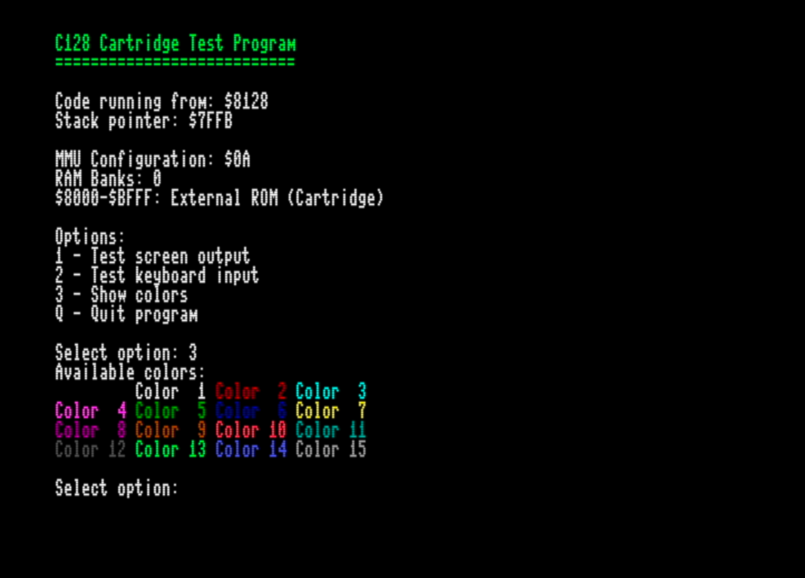

# CC65 C128 Cartridge Template

A 16KB and 32KB cartridge setup for the Commodore 128 using CC65.

Inspired by the excellent C64 version:  
https://github.com/jviskari/cc65cart

The program boots in both 40- and 80-column modes.



---

## 🛠️ Building & Running

On macOS or Linux, simply run:

```sh
make run
```

This will launch VICE x128 with the correct cartridge image.

## 💾 Cartridge Notes
	•	Builds are located in the build/ folder.
	•	In VICE, use Cartridge Type: Generic and ID: Generic Function ROM.
	•	Be sure to select Raw Image format — this .bin file is ready for EEPROM flashing.
	•	A .crt is not built, by design.

⸻

## ⚠️ Known Issue

There is currently no safe way to return to BASIC after program execution.
The _exit routine simply restarts the program.

Most C128 cartridges behave this way, but a clean exit would be ideal — especially for Function ROM use.

💡 If you know how to solve this, PRs are very welcome!

⸻

📂 Status
	•	✅ Fully working in VICE (16KB and 32KB)
	•	✅ Builds are 16384 or 32768 bytes, suitable for ROM burning
	•	🔁 _exit restarts the cartridge (until BASIC exit is solved)
